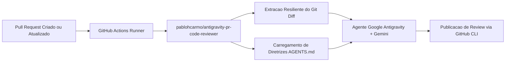
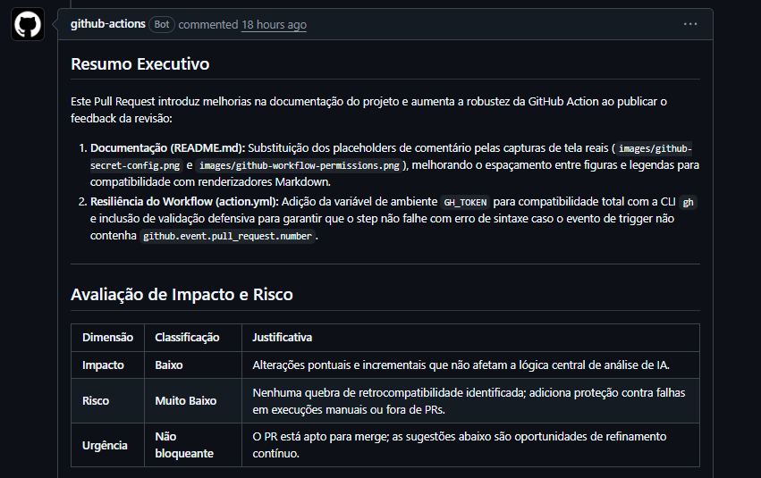

# Antigravity PR Code Reviewer

[](https://github.com/marketplace/actions/antigravity-pr-code-reviewer)
[](https://github.com/pablohcarmo/antigravity-pr-code-reviewer/releases)
[](LICENSE)

Agente autônomo para revisão de código em Pull Requests do GitHub, integrado com Google Antigravity e modelos Google Gemini, distribuído como uma GitHub Action composta reutilizável. O agente atua sob a perspectiva de engenharia de software sênior, avaliando vulnerabilidades de segurança (OWASP), padrões arquiteturais (SOLID, Clean Code), impacto de performance e manutenibilidade.

---

## Sumário

- [Visão Geral](#visão-geral)
- [Arquitetura de Execução](#arquitetura-de-execução)
- [Pré-requisitos](#pré-requisitos)
- [Guia de Integração](#guia-de-integração)
  - [1. Obtenção da Chave de API no Google AI Studio](#1-obtenção-da-chave-de-api-no-google-ai-studio)
  - [2. Configuração de Secrets no GitHub](#2-configuração-de-secrets-no-github)
  - [3. Criação do Workflow no Repositório](#3-criação-do-workflow-no-repositório)
- [Parâmetros da Action (Inputs)](#parâmetros-da-action-inputs)
  - [Seleção e Disponibilidade de Modelos](#seleção-e-disponibilidade-de-modelos)
- [Personalização de Diretrizes (AGENTS.md)](#personalização-de-diretrizes-agentsmd)
- [Exemplo de Análise em Pull Request](#exemplo-de-análise-em-pull-request)
- [Estrutura do Repositório](#estrutura-do-repositório)
- [Diagnóstico e Solução de Problemas](#diagnóstico-e-solução-de-problemas)
- [Licença](#licença)

---

## Visão Geral

O **Antigravity PR Code Reviewer** padroniza o processo de code review contínuo sem demandar infraestrutura dedicada, servidores intermediários ou permissões administrativas invasivas de GitHub Apps de terceiros.

Principais características técnicas:

- **Isolamento e Segurança:** A execução ocorre integralmente no runner do GitHub Actions do próprio repositório cliente. A comunicação ocorre diretamente entre o runner e a API do Gemini via HTTPS.
- **Resiliência Git:** Algoritmo defensivo de extração de `git diff` compatível com pull requests originados de branches internos, forks e diferentes estratégias de checkout.
- **Tolerância a Falhas:** Mecanismo de retry com backoff exponencial para lidar com limites transitórios de taxa da API de IA.
- **Truncamento Inteligente:** Proteção contra estouro de contexto em diffs extensos, priorizando estatísticas gerais de modificação (`git diff --stat`) e cabeçalhos de arquivos.
- **Governança Declarativa:** Aplicação automática das diretrizes do arquivo `AGENTS.md` presente no repositório de destino, assegurando consistência com as convenções de cada projeto.

---

## Arquitetura de Execução



1. O evento do Pull Request aciona o workflow no runner do GitHub Actions.
2. A Action obtém a árvore de alterações entre o branch de origem e a base de destino.
3. As diretrizes do projeto são lidas do arquivo `AGENTS.md` do repositório cliente; se inexistente, adota-se o conjunto sênior pré-configurado na Action.
4. O agente analisa o código contra critérios de segurança, performance, arquitetura e manutenibilidade.
5. O relatório executivo formatado em Markdown é publicado diretamente na discussão do PR via GitHub CLI (`gh`).

---

## Pré-requisitos

- Chave de API ativa do Google Gemini gerada no Google AI Studio.
- Permissão de escrita habilitada para workflows em **Settings > Actions > General > Workflow permissions** (`Read and write permissions`).

---

## Guia de Integração

### 1. Obtenção da Chave de API no Google AI Studio

Para utilizar o modelo Gemini:

1. Acesse o [Google AI Studio](https://aistudio.google.com/) e autentique-se com sua conta Google.
2. No menu de navegação, selecione **Get API key**.
3. Clique em **Create API key**.


*Figura 1: Acesso ao painel de credenciais de API no Google AI Studio.*

4. Selecione o projeto do Google Cloud correspondente e confirme a criação.


*Figura 2: Definição do projeto associado à chave de API.*

5. Copie a chave gerada e armazene-a de forma segura.


*Figura 3: Exibição da chave de API pronta para armazenamento.*

---

### 2. Configuração de Secrets no GitHub

A chave de API deve ser configurada como GitHub Secret:

#### Configuração em Organização (Recomendado para múltiplos repositórios)
1. Navegue até **Organization Settings > Secrets and variables > Actions**.
2. Clique em **New organization secret**.
3. Defina o nome como `GEMINI_API_KEY` e insira o token obtido.
4. Em **Repository access**, selecione **All repositories** ou restrinja aos repositórios desejados.

#### Configuração em Repositório Individual
1. No repositório desejado, navegue até **Settings > Secrets and variables > Actions**.
2. Clique em **New repository secret**.
3. Defina o nome como `GEMINI_API_KEY` e insira o token.


*Figura 4: Cadastro do secret GEMINI_API_KEY nas configurações de Actions.*

---

### 3. Criação do Workflow no Repositório

Crie o arquivo de definição do pipeline no repositório cliente:

`.github/workflows/code-review.yml`

```yaml
name: Antigravity Code Review

on:
  pull_request:
    types: [opened, synchronize, reopened]

permissions:
  contents: read
  pull-requests: write

concurrency:
  group: ${{ github.workflow }}-${{ github.event.pull_request.number || github.ref }}
  cancel-in-progress: true

jobs:
  review:
    runs-on: ubuntu-latest
    if: github.actor != 'dependabot[bot]'

    steps:
      - name: Checkout do repositorio
        uses: actions/checkout@v4
        with:
          fetch-depth: 0

      - name: Executar Code Review com Antigravity
        uses: pablohcarmo/antigravity-pr-code-reviewer@v1
        with:
          gemini_api_key: ${{ secrets.GEMINI_API_KEY }}
```

> [!IMPORTANT]
> Certifique-se de que a opção **Read and write permissions** está selecionada em **Settings > Actions > General > Workflow permissions** para permitir que a Action comente no Pull Request.


*Figura 5: Habilitação de permissões de leitura e escrita para o GITHUB_TOKEN no repositório.*

---

## Parâmetros da Action (Inputs)

| Parâmetro | Tipo | Obrigatório | Padrão | Descrição |
| :--- | :--- | :---: | :---: | :--- |
| `gemini_api_key` | String | Sim | — | Chave de API do Google Gemini obtida no Google AI Studio. |
| `github_token` | String | Não | `${{ github.token }}` | Token do GitHub com permissão de escrita em PRs (`pull-requests: write`). |
| `agents_file` | String | Não | `AGENTS.md` | Caminho do arquivo contendo as diretrizes customizadas no repositório cliente. |
| `gemini_model` | String | Não | *(padrão do SDK)* | Identificador do modelo Gemini específico a ser utilizado (ex: `gemini-2.5-flash`, `gemini-1.5-pro`). |

### Seleção e Disponibilidade de Modelos

Por padrão, a Action utiliza o modelo estável padrão configurado internamente no SDK `google-antigravity` (família Flash, como `gemini-2.5-flash`), garantindo processamento rápido e ampla cota gratuita sem exigir qualquer configuração adicional.

Caso deseje direcionar para uma versão específica, defina o parâmetro `gemini_model`:

```yaml
      - name: Executar Code Review com Antigravity
        uses: pablohcarmo/antigravity-pr-code-reviewer@v1
        with:
          gemini_api_key: ${{ secrets.GEMINI_API_KEY }}
          gemini_model: 'gemini-1.5-pro'
```

Diretrizes de seleção:

- **Modelos Flash (ex: `gemini-2.5-flash`, `gemini-1.5-flash`):** Ideais para alta cadência de Pull Requests, menor tempo de espera no pipeline e consumo eficiente de tokens.
- **Modelos Pro (ex: `gemini-1.5-pro`):** Recomendados para análises mais profundas que demandem maior capacidade analítica em bases de código complexas ou revisões críticas.
- **Disponibilidade e Quotas:** A disponibilidade depende exclusivamente dos modelos ativos na sua conta e chave do [Google AI Studio](https://aistudio.google.com/). Caso seja informado um modelo inexistente ou sem permissão de acesso, a API retornará falha (`404 / 400`). Para a maioria dos casos, recomenda-se manter o valor padrão.

---

## Personalização de Diretrizes (AGENTS.md)

A Action inclui internamente um conjunto abrangente de diretrizes de nível sênior em [AGENTS.md](AGENTS.md), cobrindo sanitização de inputs, injeção de dependências, OWASP Top 10, complexidade de código e práticas de concorrência.

Para sobrepor ou estender essas regras com os padrões específicos da sua organização, basta criar um arquivo `AGENTS.md` na raiz do projeto consumidor:

```markdown
# Diretrizes de Engenharia do Projeto

1. Arquitetura:
- Seguir estritamente o padrão de Arquitetura Limpa (Clean Architecture).
- Camadas de domínio não devem possuir acoplamento com frameworks externos.

2. Segurança e Validação:
- Todas as entradas de endpoints REST devem ser validadas via DTOs tipados.
- É vedado expor stack traces ou IDs internos em payloads de resposta de erro.
```

Caso o arquivo resida em outro diretório, especifique o caminho via input `agents_file`:

```yaml
      - name: Executar Code Review com Antigravity
        uses: pablohcarmo/antigravity-pr-code-reviewer@v1
        with:
          gemini_api_key: ${{ secrets.GEMINI_API_KEY }}
          agents_file: 'docs/ENGINEERING_GUIDELINES.md'
```

---

## Exemplo de Análise em Pull Request

Após a execução do workflow, o relatório é publicado diretamente na discussão do Pull Request, apresentando um resumo executivo estruturado e a matriz de risco e impacto:



*Figura 6: Relatório estruturado publicado pela Action na timeline do Pull Request.*

---

## Estrutura do Repositório

```text
├── .github/
│   └── workflows/
│       └── code-review.yml       # Validação e teste contínuo da Action
├── scripts/
│   └── ai_code_review.py         # Orquestrador do agente e integração com Git
├── images/                       # Recursos visuais da documentação
├── action.yml                    # Definição e metadados da GitHub Action Composta
├── AGENTS.md                     # Diretrizes padrão de revisão sênior
├── requirements.txt              # Dependência do SDK (google-antigravity)
├── LICENSE                       # Licença de uso
└── README.md                     # Documentação técnica do projeto
```

---

## Diagnóstico e Solução de Problemas

| Sintoma | Causa Provável | Ação Corretiva |
| :--- | :--- | :--- |
| `GEMINI_API_KEY não configurada. Review ignorado.` | Secret ausente ou inacessível no escopo do workflow. | Cadastre o secret `GEMINI_API_KEY` nas configurações de Actions do repositório ou da organização. |
| `gh: Resource not accessible by integration` | O token de execução não possui autorização para interagir com a API de Pull Requests. | Habilite **Read and write permissions** em **Settings > Actions > General > Workflow permissions** e inclua `pull-requests: write` na seção `permissions` do workflow. |
| `Nenhuma alteração de código encontrada para revisar.` | O checkout foi realizado de forma rasa (shallow clone), impedindo o cálculo do diff contra a base. | Certifique-se de que a etapa `actions/checkout` inclua o parâmetro `fetch-depth: 0`. |

---

## Licença

Distribuído sob os termos da [Licença MIT](LICENSE).